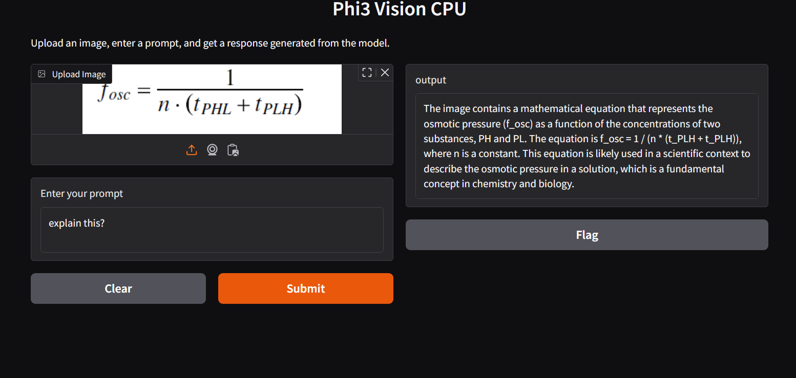

# Running Phi3.5 Vision on CPU with Docker

This guide will help you set up and run the Phi3.5 model (or similar Hugging Face models) using Docker on a CPU. Follow the instructions below to build the Docker image, run the container, and access the Hugging Face UI locally.

### Prerequisites:
- Docker installed on your system.
- A valid Hugging Face authentication token. You can obtain your token from your [Hugging Face account](https://huggingface.co/settings/tokens).

---

### Steps to Run Phi3.5 with Docker

#### 1. Clone the Repository
First, clone the repository where the Dockerfile and necessary scripts are located:

```bash
git clone https://github.com/neerajtiwari360/understand_LLM.git
cd microsoft/phi3.5_vision
```

#### 2. Set Your Hugging Face Token
Create a `.env` file or pass your Hugging Face token directly during the build process.

#### 3. Build the Docker Image
Pass your Hugging Face token as a build argument:

```bash
docker build --build-arg HF_AUTH_TOKEN=your_hugging_face_token -t chatbot-api .
```

This will build the Docker image with the necessary dependencies and configuration for Phi3.5.

#### 4. Run the Container
Once the image is built, you can run the Docker container:

```bash
docker run -p 4050:4050 chatbot-api
```

This will run the container and expose the model’s API at `http://localhost:4050`. You can use this endpoint to interact with the model.

---

### Hugging Face UI

Once the container is running, you can access the Hugging Face UI through your browser at the following URL:

```
http://localhost:4050
```

You will see the Hugging Face model UI where you can interact with the Phi3.5 model. Here’s how it should look like (example):



> **Note**: Replace `path_to_your_local_image/ui_example.png` with the actual path to the screenshot of the Hugging Face UI on your machine. If you don't have a local image, you can either take a screenshot of the Hugging Face interface or use a placeholder image.

---

### Stopping the Container
To stop the container, simply press `CTRL+C` in the terminal or run the following command:

```bash
docker stop <container_id>
```

You can find the `<container_id>` by running `docker ps` to list running containers.

---

### Troubleshooting

- **Error: "Hugging Face Token Missing"**:
  - Ensure you've provided a valid Hugging Face token by passing it as a build argument (`--build-arg HF_AUTH_TOKEN=your_hugging_face_token`).

- **Container Not Starting**:
  - Make sure Docker is installed and running properly on your machine.
  - Check if port `4050` is available on your machine, and ensure no other services are using it.

---

## Additional Resources

To better understand the deployment process and how to maximize Phi-3’s capabilities, check out the following resources:

- **Blog**: Learn the complete setup and the benefits of small LLMs in this detailed [Medium blog post](https://medium.com/@neeraztiwari/exploring-microsofts-phi-3-5-419304cbc008).
- **YouTube Video**: Watch the step-by-step guide on [YouTube](https://youtu.be/KnMdpNrtViE?si=5d5mdV0Jj5tTk4Oh).
